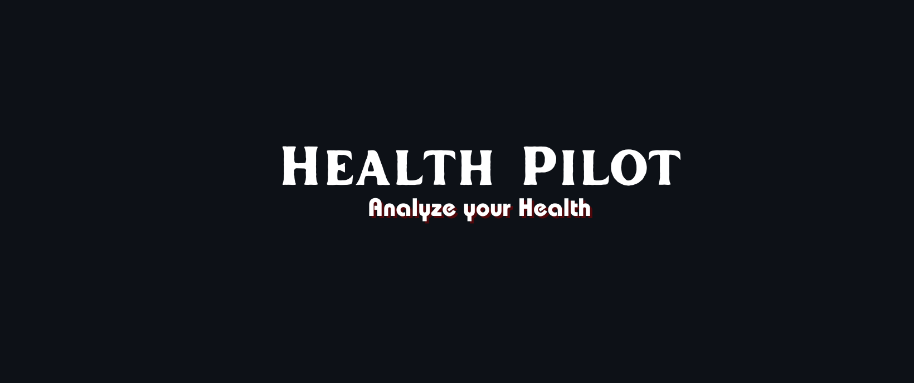

<br>


<BR>


<br>


<br><br>

## 🗒️ Table of Contents

- [What is Health Pilot?](#-what-is-health-pilot)
- [Features](#-features)
- [Integrating Google Sheets](#%EF%B8%8F-integrating-google-sheets)
- [Installation](#-installation)
- [Run Application](#%EF%B8%8F-run-application)
- [How to Use](#-how-to-use)
- [Working](#-working)
- [Contributors](#-contributors)
<br>

## ⭐ What is Health Pilot?

Welcome to Health Pilot. Your virtual co-pilot for a healthier you! It is a Diabetes and Heart Disease Prediction System. This platform is designed to predict and analyze diabetes and heart disease using trained machine learning models. Our platform leverages state-of-the-art machine learning models to provide swift and accurate predictions based on the data you input. Whether you're assessing your risk factors, monitoring your health journey, or seeking preventive measures, our user-friendly interface empowers you with valuable insights. Also provides you with the necessary precautions(possible with AI integration) that you need to take if you have these diseases. So let Health Pilot be your passport to healthier journey ahead!

<br><br>

## 🤓 Features

- Quick and accurate disease predictions.
- Experience a seamless and user-friendly interface designed to simplify your health journey.
- Safely store and manage your previous health reports, creating a comprehensive archive for easy reference and tracking.
- Provides Guidelines for effective diabetes and heart disease control.
- Google Sheets integration for data storage.
- Data visualization for analysis.
<br><br><br>


## 🗄️ Integrating Google sheets
This applications uses Google Sheets as our data storage solution. We connected Health Pilot with google sheets with the help of Google Sheets API which is available on Google Cloud. The below are the steps followed to acheive the connection with google sheets:
- Create a new project on Google Cloud and enable the Google Sheets API.
- Create a API credentials and generate its JSON key file.
- Create a new google sheet and give the 'client email' from json key file the editor access.
- Now, install the required Python libraries in the project to establish the connection:<br><br>
  gspread, google-auth, google-auth-oauthlib and google-auth-httplib2
    
    ```bash
    pip install gspread google-auth google-auth-oauthlib google-auth-httplib2
    
    ```

    <br><br>


## 🔨 Installation

Before running the application, ensure you have the following installed on your machine:<br><br>


<br>

- Streamlit
    
    ```bash
    pip install streamlit
    
    ```
    
- Plotly
    
    ```bash
    pip install plotly
    
    ```
    

    
- OpenAI
    
    ```bash
    pip install openai
    
    ```
    
- Streamlit Option Menu
    
    ```bash
    pip install streamlit-option-menu
    
    ```
    

While the other libraries are already present in your Python Standard Library. Additionally, for using the openai library, you need to have an OpenAI API key. Make sure to set up your OpenAI API key and store it securely. You can follow the OpenAI documentation to obtain your API key. Once you have your API key, you can set it up in your project by using dotenv to load environment variables from a file. Create a file named .env in your project directory and add the following line:

```bash
OPENAI_API_KEY=your_api_key_here

```

Replace <i><b>your_api_key_here</b></i> with your actual OpenAI API key. Lastly, in your Python code, add the following lines at the beginning:

```bash
from dotenv import load_dotenv
load_dotenv()

```

<br>

## 🏃‍♀️ Run Application

Clone the project

```bash
  git clone <https://github.com/Ayesha-Siddiqua88/Health-Pilot.git>

```

Go to the project directory

```bash
  cd my-project

```

Run the following code in terminal

```bash
  streamlit run app.py

```

<br>

## 🤔 How to Use

1. **Select a Disease Prediction:**
    - Use the sidebar to choose the disease prediction you are interested in (Diabetes, Heart Disease).
2. **Data Entry:**
    - Fill in the required information for the selected disease prediction.
    - Click the respective prediction button to get the result.
3. **View Results:**
    - View the prediction result and relevant information.
    - Explore additional analysis and visualizations available.

<br>

## 🎥 Working

https://github.com/Ayesha-Siddiqua88/Health-Pilot/assets/128472306/9a4522fc-2a15-418d-bbfc-cd4d25900a02

 


<br>

## 💙 Contributors

[](https://github.com/Asma-Khanam)
